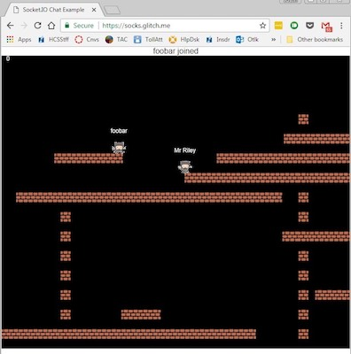
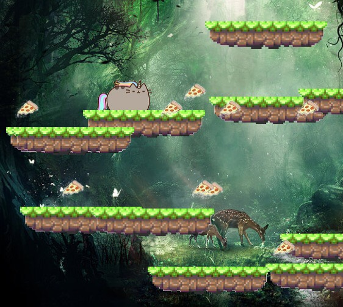
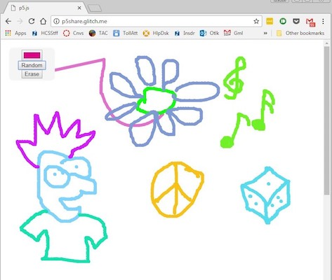

# NodeJS First Steps

I watched [Glitch.com's YouTube vid "Website Starter Kit. Part 4: Intro to Node"](https://m.youtube.com/watch?v=c5Xd8xPBuOA) and became obsessed with making multi-player web apps. My web design students have been beta testing them with my Seniors even trying to hack them!

<https://m.youtube.com/watch?v=c5Xd8xPBuOA>

## Trivia

My 1st Node app was a trivia game based on [Glitch.com's Website Starter Kit intro to node](https://glitch.com/edit/#!/intro-to-node). My thinking was just... how can I handle question/answer storage server-side? I was excited when I realized the server was storing game progress & it was already co-op multiplayer.

The trivia game has gone through three iterations.
1.	[triviagame.glitch.me](http://triviagame.glitch.me)
2.	[trivia2.glitch.me](http://trivia2.glitch.me)
3.	[trivia3.glitch.me](http://trivia3.glitch.me)

Here is video of version 3. I learned @SocketIO by remixing @_gw & @jennschiffer's [glitch.com/edit/#!/socketio-chat](https://glitch.com/edit/#!/socketio-chat) project.

## Platformer

My high school game design students made @p5xjs platformer games after watching some @shiffman #codingtrain videos. Here's one student project (hosted by @glitch) [cats2thepizzawars.glitch.me](http://cats2thepizzawars.glitch.me) 

After I learned @SocketIO I decided to try coding a multiplayer #p5js platformer next...

Still a work in progress but I'm happy w/ [socks.glitch.me](http://socks.glitch.me) In the course of making that I learned about how linear interpolation is used to smooth out movement between server updates. At some point I can re-implement my coin class & enemy class, now that I know NodeJS

## Paint

Finally, I wanna share [p5share.glitch.me](http://p5share.glitch.me) which is a shared @p5xjs canvas based on this starter #p5js sketch [p5js.org/get-started/#sketch](https://p5js.org/get-started/#sketch) In this I used AJAX polling rather than Socket.IO but I'll probably switch it someday. Still a few bugs but fun, interactive art.